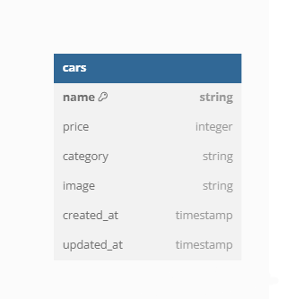

# Car Management Dashboard

Car Management Dashboard is an application used to manage car data. This application can display a list of cars, add, edit, and delete existing car data.

## Installation

First you need to have [MongoDB](https://www.mongodb.com/try/download/compass) installed on your computer. Then, please follow these steps below in order to run this application :

1. On your terminal :

```
git clone
npm install
npm install dotenv
```

2. Create .env file, copy the env variable from .env.example file
3. Start the project with this command :

```
npm run dev
```

Now you can run the application on your device. Server should be running at <http://localhost:your-port> while database should be at <http://127.0.0.1/your-connection-string>

### Database Table Diagram

This application using MongoDB as the database. Here's the diagram :


#### List of API Endpoints

_localhost:8000_

Dashboard View

- Description : Retrieve the dashboard view.
- HTTP Method : GET
- Endpoint: `/dashboard`
- Usage Example: `/dashboard`

Create Car Page

- Description : Retrieve the page to create a new car.
- HTTP Method : GET
- Endpoint: `/dashboard/create`
- Usage Example: `/dashboard/create`

Edit Car Page

- Description : Retrieve the page to edit car information based on ID.
- HTTP Method : GET
- Endpoint: `/dashboard/edit/:id`
- Usage Example: `/dashboard/edit/123`

**Action API**

Add New Car

- Description : Add a new car to the system
- HTTP Method : POST
- Endpoint: `/cars/add`
- Usage Example: `/cars/add`

Delete Car

- Description : Delete car information based on ID.
- HTTP Method : GET
- Endpoint: `/cars/delete/:id`
- Usage Example: `/cars/delete/456`

Edit Car

- Description :Edit car information based on ID
- HTTP Method : POST
- Endpoint: `/cars/update/:id`
- Usage Example: `/cars/update/789`
